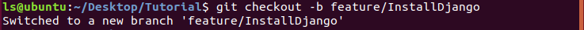

# Git、GitHub、Git flow、PyCharm教學
## 流程
### 前置準備
=== github.com

01. 新增GitHub Repository  
      

02. 選擇初始化README.md、.gitignore(Python)  
      

=== Ubuntu Terminal

03. 從GitHub複製專案, 進入專案資料夾  
      
```bash
$ git clone [ProjectURL]
$ cd [ProjectFolder]
```

04. 修改.gitignore, 在結尾新增程式碼  
      
```bash
$ vim .gitignore
  > # Pycharm
  > .idea/
```

05. 設定gitconfig  
      
```bash
$ git config merge.ff no                                        # 避免merge時使用fast-forward
(optional)$ git config user.email "[AnotherEmail]"              # 如果有多個github帳號 可以改email來切換
```

=== PyCharm  

06. 使用Pipenv建立虛擬環境, 並確認Python版本(2.x/3.x)  
      
      
```PyCharm
  File->Settings->Project: [ProjectName]->Project Interpreter
  Gear(齒輪)->Add...->Pipenv Environment->OK
```

### 撰寫程式
Git Flow介紹: https://gitbook.tw/chapters/gitflow/why-need-git-flow.html  
  
從master新增develop和feature這兩個新的branch  
由於開發過程中feature會有很多, 所以會命名為feature/[FeatureFunction] (階層或資料夾的感覺)  
開發時從develop新增feature-branch出來, 完成功能後再merge回develop
通常feature-branch的commit會留在本地端(電腦), 避免遠端commit過於雜亂  
實際完成功能後的develop、release、master才會push到github上  

=== Ubuntu Terminal

01. 從master到develop-branch  
      
```bash
$ git branch develop
$ git checkout develop
# 兩個指令也可以合併為 $ git checkout -b develop
```

02. 從develop開feature-branch  
      
```bash
$ git branch feature/[NewFeature]                               # 命名如: feature/AddGUI
$ git checkout feature/[NewFeature]
```

03. 開始撰寫新功能  
      
> 做事...  
> 做到一個段落  
```bash
(optional) $ git status                                         # 查看目前git狀況
$ git add .                                                     # 暫存所有修改
$ git commit                                                    # 提交修改
# 也可直接用 $ git commit -m "[CommitMessage]" 在指令內撰寫commit message
```
> 繼續做事...  
> 重複步驟3直到功能完成  
> 完成新功能後跳到步驟4  

04. 將完成的feature合併回develop  
      
      
```bash
$ git checkout develop                                          # 先切換到develop
$ git merge feature/[NewFeature]                                # 將feature合併回develop
(optional)$ git graph                                           # 查看目前branch狀況
(optional)$ git push (orgin develop)                            # 推送至github, 第一次需加orgin [BranchName]
```
> 繼續新增功能...  
> 重複步驟2 3 4直到完成所有功能  
> 準備release, 跳到步驟5  

05. 從develop開release-branch  
      
```bash
(optional)$ git status                                          # 確保是從develop開branch
$ git checkout -b release/[Version]                             # 命名如: release/v0.1.0
```
> release階段只修bug, 不加新功能  
> 修bug...(同步驟3)  
> 修完所有bug後跳到步驟6  

06. 將完成的release合併到develop和master  
      
```bash
$ git checkout develop
$ git merge release/[Version]
$ git checkout master
$ git merge release/[Version]
```

07. 已release的master加上版本tag, 可以使用git graph或其他GUI工具(如GitKraken)查看目前branch狀態
      
      
```bash
(optional)$ git status                                          # 確保是在master-branch上加tag
$ git tag -a [Version] -m "[VersionMessage]"                    # 幫該commit加版本號, 如: -a v0.1.0 -m "Add GUI"
(optional)$ git graph
```

07. 收尾, 準備開發新的功能  
      
      
```bash
$ git checkout develop                                          # 回到develop-branch準備新功能的開發
(optional)$ git push origin master release develop              # 更新遠端repository
(optional)$ git branch -d feature/[NewFeature]                  # 本地端的feature已完成階段性任務, 可以刪除
```
> 回到步驟2  

----------------------------------------------------------------
## 環境架設(for Ubuntu)
首次使用需安裝[git, vim, Pycharm, pip3, pipenv]  

### git
```bash
$ sudo apt install git
$ git config --global user.name "[YourName]"
$ git config --global user.email "[YourEmail]"                  # 設定email, 盡量和github帳號用同一個
$ git config --global merge.ff no                               # 避免merge時使用fast-forward
```
```bash
$ git config --global alias.graph "log --graph --abbrev-commit --decorate --format=format:'%C(bold blue)%h%C(reset) - %C(bold green)(%ar)%C(reset) %C(white)%s%C(reset) %C(dim white)- %an%C(reset)%C(bold yellow)%d%C(reset)' --all"
# 新增graph指令 可用$ git graph 繪製當下的branch和commit圖形
```
 
### vim
```bash
$ sudo apt install vim
```
### Pycharm
```bash
$ sudo snap install pycharm-community --classic
```
### pip3
```bash
$ sudo apt install python3-pip
```
### pipenv
```bash
$ pip3 install pipenv
# 日後安裝套件須在專案資料夾內 改用 $ pipenv install [Package]
```
